::: {.cover-page}
::: {.cover-topline}
Data Science Lab 2026
:::

# Data Science Movies

## Analyzing and Predicting Movie Success Across Film Industries

::: {.cover-summary}
An interactive HTML report that combines descriptive analysis and machine learning to study what makes movies successful in ratings, audience engagement, and box office performance.
:::

::: {.cover-stats}
::: {.cover-stat}
**63,249**  
movies
:::
::: {.cover-stat}
**12**  
research questions
:::
::: {.cover-stat}
**2**  
analysis parts
:::
:::

::: {.cover-meta}
**Authors**  
Aya Abdine, Meriam El Askri, Kaylee Dramat, Ghofran Mahmoud, Mcolisi Austine, Syed Arshan Nehad, Syed Tamjeed Ur Rahman

**Date**  
31/5/2026
:::
:::

::: {.report-page}
# Executive Summary

::: {.summary-grid}
::: {.summary-text}
This report explains a complete data science project about movie success. The project uses a cleaned IMDb-style dataset with 63,249 movies and 23 original variables, including rating, votes, duration, budget, opening weekend gross, worldwide gross, US/Canada gross, release date, countries of origin, genres, directors, writers, and stars.

The project is divided into two connected parts. The descriptive analysis explains what patterns already exist in the data. It compares countries, genres, duration, revenue, budget levels, and talent profiles. The machine learning analysis then asks whether those movie attributes can be used to predict outcomes such as rating, worldwide revenue, votes, release timing performance, and a general success label.

The main finding is that movie success is not one single thing. Ratings, votes, and revenue behave differently. Some genres and countries receive high average ratings, but the highest box office results are concentrated in action, superhero, animation, and franchise-style genres. Runtime alone does not strongly explain ratings or votes. Budget is positively related to worldwide revenue, but it does not guarantee profitability. Talent prominence, measured by appearance count, does not meaningfully improve ratings.

For prediction, machine learning works best when the data is carefully cleaned and skewed targets are log-transformed. Gradient Boosting performs best for rating and revenue prediction. Random Forest performs best for high-rating classification and success classification. The results are useful, but not perfect, because the dataset does not include all real-world drivers of movie success, such as marketing spend, distribution size, reviews, franchise history, or social media attention.
:::

::: {.book-card}

▣ Project Book

**Part 1: Descriptive Analysis**

1. Ratings by country  
2. Genre, ratings, and votes  
3. Runtime, ratings, and votes  
4. Revenue differences by genre  
5. Budget and box office performance  
6. Talent prominence and audience response  

**Part 2: Machine Learning**

1. Predicting rating  
2. Predicting worldwide revenue  
3. Classifying high-rated movies  
4. Predicting audience votes  
5. Release timing and performance  
6. Classifying movie success  

:::
:::
:::

::: {.report-page}
# Introduction

The movie industry is a useful field for data science because success is visible but complicated. A movie can be considered successful because it receives a high rating, earns strong revenue, attracts many audience votes, becomes profitable compared with its budget, or performs well across several of these measures. These outcomes do not always move together. A small documentary may receive excellent ratings but limited revenue, while a large franchise movie may earn hundreds of millions even if its rating is only moderate.

This project studies that complexity using a movie dataset that combines audience evaluation, financial information, release information, genre labels, and movie personnel. The goal is to understand movie success from two angles. The first angle is descriptive: what patterns can we observe in the dataset? The second angle is predictive: can machine learning models use movie attributes to predict future outcomes?

The analysis follows a data science workflow. First, the raw fields are cleaned because many important columns are stored as text. Votes include suffixes such as `K` and `M`, duration is written as hours and minutes, money fields include currency formatting, and genres, directors, writers, and stars are stored as list-like strings. After cleaning, the descriptive questions use grouped summaries and visualizations. The machine learning questions then create training and testing data, compare models, and evaluate them with appropriate metrics.
:::

::: {.report-page}
# Literature Review

Previous work on movie analytics often shows that box office success depends on several groups of variables rather than one simple factor. Production budget is usually one of the strongest predictors of revenue because larger budgets are connected to wider marketing, better production resources, and broader release strategies. However, budget also increases financial risk, so revenue must be interpreted together with profitability.

Genre is another important factor. Action, superhero, animation, adventure, and franchise-oriented genres often perform strongly in worldwide revenue because they travel well across markets and rely less on language-specific dialogue. At the same time, genres such as documentary, drama, and historical films may receive strong ratings without producing the highest box office totals. This creates an important difference between cultural or audience appreciation and commercial scale.

Audience engagement is also different from rating quality. Vote counts show how many people interacted with a movie on IMDb, while ratings show how those users evaluated it. High votes can reflect popularity, marketing reach, franchise visibility, or controversy. High ratings can reflect quality, niche audience appreciation, or selective viewing. For this reason, the project treats rating, votes, and revenue as separate outcomes.

Machine learning is useful because movie outcomes are nonlinear. A genre may matter differently at different budget levels, and release timing may matter more for some types of films than others. Tree-based models such as Random Forest, Extra Trees, and Gradient Boosting are useful for this type of problem because they can capture interactions and threshold effects. Linear models are still included as baselines because they are easier to interpret and show whether simple relationships are already informative.
:::

::: {.report-page}
# Dataset Description

The main dataset is stored in `Data/final_dataset.csv`. It contains movie-level information such as `title`, `duration`, `mpa`, `rating`, `votes`, `budget`, `opening_weekend_gross`, `gross_worldwide`, `gross_us_canada`, `release_date`, `countries_origin`, `genres`, `directors`, `writers`, and `stars`.

The cleaning work converted the dataset into analysis-ready variables. Duration values were converted into numeric minutes. Vote strings such as `8.3K` were converted into numeric vote counts. Budget and revenue fields were parsed from formatted money strings into numeric values. Release dates were converted into year, month, and season variables. Genre, country, director, writer, and star fields were parsed from list-like text into categories or count variables.

Rows were not removed globally at the beginning. Instead, each question applied the cleaning rules needed for its own target. For example, the budget analysis required both budget and worldwide gross, while the rating questions only needed rating and the selected predictors. This preserved as much information as possible for each part of the project.

::: {.ownership-box}
**Contributor ownership**

Descriptive Analysis: Q1 Kaylee Dramat, Q2 Kaylee Dramat, Q3 Kaylee Dramat, Q4 Ghofran Mahmoud, Q5 Ghofran Mahmoud, Q6 Ghofran Mahmoud.  
Machine Learning: Q1 Aya Abdine & Meriam El Askri, Q2 Aya Abdine & Meriam El Askri, Q3 Aya Abdine & Meriam El Askri, Q4 Mcolisi Austine, Q5 Syed Arshan Nehad, Q6 Syed Tamjeed Ur Rahman.
:::
:::

::: {.part-divider}
# Part 1: Descriptive Analysis
:::

::: {.report-page}
## Descriptive Question 1 (Kaylee Dramat)

**Question:** How do movie ratings vary across countries of origin?

This question examines whether movies from different countries receive different average IMDb ratings. The purpose is not to claim that one country makes better movies than another. Instead, the goal is to see whether country of origin is connected to visible rating patterns. Country can reflect production culture, film tradition, language, distribution, and which movies become internationally visible.

**How we worked with the data:** The country column was cleaned so movies could be grouped by country of origin. Ratings were converted into numeric values. The analysis focused on countries with enough movies to make the comparison meaningful, because a country represented by only a few movies could appear artificially high or low.

**Objective:** Identify the countries with the highest average ratings and interpret whether country of origin appears to matter for audience evaluation. This objective is important because country is not only a geographic label; it can also represent differences in film traditions, production systems, language, release access, and audience expectations. The analysis helps the reader understand whether rating patterns are spread evenly across countries or whether some countries stand out in the dataset. It also makes clear that the result should be treated as an observed pattern, not as a final ranking of national cinema quality.

**Results and graph:** The highest average ratings included countries such as Iran, Czechoslovakia, the Soviet Union, Singapore, Egypt, Iceland, Hungary, India, Japan, and Turkey.

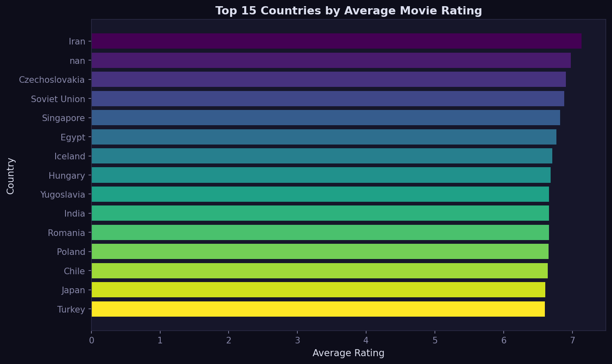

**Interpretation:** The graph shows that average rating differs across countries. Smaller or more selective film industries can rank highly because only stronger or more internationally visible films may appear in the dataset. This means the result should be interpreted as a pattern in the dataset, not as a universal ranking of national film quality. For movie success, country of origin may influence audience perception, but it should be considered together with genre, release reach, and the type of movies represented.

**Student responsible:** Kaylee Dramat
:::

::: {.report-page}
## Descriptive Question 2 (Kaylee Dramat)

**Question:** Which genres receive the highest ratings and most audience engagement?

This question separates two important success measures: quality evaluation and audience reach. Rating measures how positively viewers evaluate a movie. Votes measure how many users engaged with the movie on IMDb. A movie can have high ratings with a smaller audience, or it can have many votes because it is popular, widely released, or part of a franchise.

**How we worked with the data:** Genre values were parsed from list-like text and grouped by genre. The notebook calculated average rating and average vote count separately. Two graphs were used because rating and votes have different meanings and different scales.

**Objective:** Find which genres are strongest in rating quality and which genres attract the most audience engagement. This objective separates two meanings of success that are often confused. A highly rated genre may be appreciated deeply by a smaller audience, while a highly voted genre may have broader visibility and commercial reach. By comparing both measures, the report shows whether genre success is based on audience approval, audience size, or both. This helps the professor see why rating and popularity should not be interpreted as the same outcome.

**Results and graphs:** Highly rated genres included Sports Documentary, Epic, War Epic, Historical Epic, Music Documentary, Tragedy, Documentary, Anime, Sci-Fi Epic, and Action Epic.

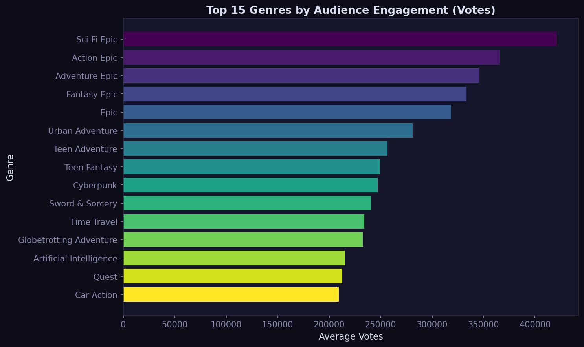

**Interpretation:** The results show that popularity and rating quality are not identical. Some documentary, historical, and epic genres receive strong ratings, possibly because they attract viewers who are already interested in that type of film. More mainstream or franchise-friendly genres often attract more votes because they reach larger audiences. For movie success, this means a producer or analyst should not use rating alone as the full measure of impact. Audience engagement gives a different story.

**Student responsible:** Kaylee Dramat
:::

::: {.report-page}
## Descriptive Question 3 (Kaylee Dramat)

**Question:** How does movie duration influence audience ratings and votes?

Runtime is a useful feature because it is known before release and may affect audience willingness to watch a movie. Very short movies may be documentaries, specials, or smaller releases, while very long movies may require stronger audience commitment. This question asks whether duration is visibly connected to rating or engagement.

**How we worked with the data:** Duration values written as hours and minutes were converted into numeric runtime in minutes. The notebook then compared runtime with rating and vote count using visualizations, allowing the relationship to be inspected directly.

**Objective:** Determine whether longer or shorter movies tend to receive higher ratings or more audience votes. This objective tests a common assumption that runtime may influence audience satisfaction or willingness to engage with a movie. If longer movies consistently had higher ratings, runtime could be treated as a quality signal. If shorter movies had more votes, accessibility might be more important. The analysis therefore checks whether duration is a meaningful success factor or only a background feature that must be interpreted with genre and release context.

**Results and graphs:**

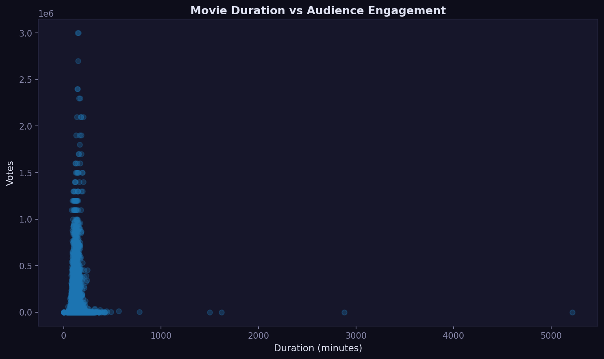

**Interpretation:** Most movies are concentrated between about 80 and 150 minutes. Within that common range, ratings vary widely. This means runtime alone does not explain whether a movie is highly rated. The vote graph also shows no simple rule that longer movies receive more votes. Audience engagement is more likely shaped by popularity, genre, release scale, and visibility. Duration may still matter in specific contexts, but it is not a strong standalone predictor of success.

**Student responsible:** Kaylee Dramat
:::

::: {.report-page}
## Descriptive Question 4 (Ghofran Mahmoud)

**Question:** How do box office revenues differ across industries?

This question focuses on commercial success. It compares genres by worldwide gross, US/Canada gross, opening weekend gross, and international revenue. This is important because revenue can come from different markets, and some genres depend heavily on global audiences.

**How we worked with the data:** Revenue values were converted from formatted currency text into numeric values. Genre lists were parsed, and the first listed genre was used as the primary genre. Rows without usable revenue data were removed. Very small genre groups were excluded to avoid unstable averages. International revenue was created as worldwide gross minus US/Canada gross.

**Objective:** Identify which genres earn the most and whether revenue differences across genres are statistically meaningful. This objective focuses on commercial success rather than audience evaluation. It asks whether box office outcomes differ enough across genres to support real business conclusions. The analysis also separates opening weekend, domestic revenue, international revenue, and worldwide revenue, because a genre can perform differently across markets. This gives a fuller view of financial success than one revenue column alone.

**Results and graphs:** Top genres by average worldwide gross included Action Epic ($363.0M), Dinosaur Adventure ($349.2M), Superhero ($310.4M), Computer Animation ($283.9M), Globetrotting Adventure ($268.0M), Kaiju ($266.8M), Sci-Fi Epic ($258.4M), and Car Action ($241.9M). The Kruskal-Wallis test gave H = 6126.13 and p < 0.001.

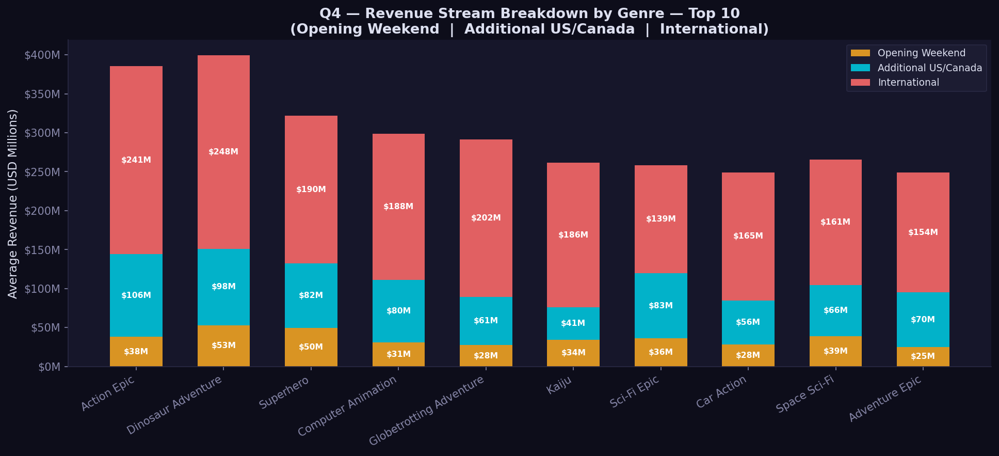

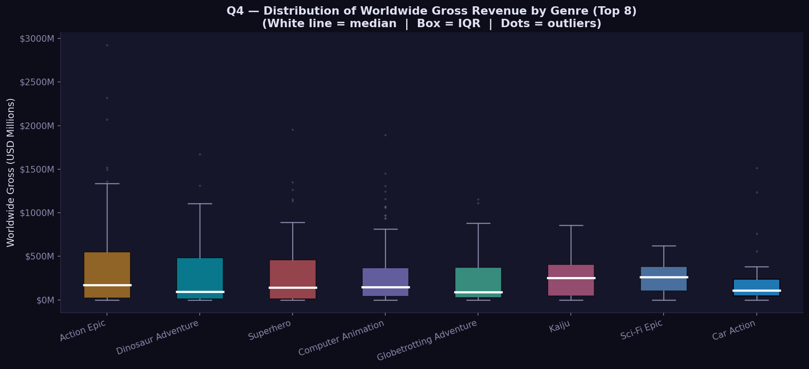

**Interpretation:** Revenue is strongly genre-dependent. Action, superhero, animation, and franchise-style categories dominate because they often have large budgets, wide releases, and strong international appeal. The international revenue breakdown shows that global markets are a major part of commercial success for these genres. The Kruskal-Wallis test confirms that the genre revenue differences are statistically significant, so the pattern is not just random noise. For movie success, genre is one of the clearest financial signals.

**Student responsible:** Ghofran Mahmoud
:::

::: {.report-page}
## Descriptive Question 5 (Ghofran Mahmoud)

**Question:** Is there a relationship between movie budget and box office performance?

This question asks whether spending more money on production leads to stronger box office results. It also considers profitability, because a movie with high revenue is not necessarily successful if its budget is extremely high.

**How we worked with the data:** Budget and revenue columns were converted from currency strings into numeric values. The analysis kept movies with both budget and worldwide gross. ROI was calculated to compare profit relative to budget, and opening ratio was calculated to see how front-loaded revenue was. Movies were grouped into low, mid, and high budget tiers.

**Objective:** Examine whether budget is connected to worldwide gross, profitability, and opening weekend behavior. This objective is broader than simply asking whether expensive movies earn more money. It also asks whether higher spending produces better returns relative to cost and whether revenue arrives quickly during opening weekend or accumulates over time. This matters because a movie can have high gross revenue but still be financially weak if its budget was too large. The goal is to understand budget as both an opportunity and a risk.

**Results and graphs:** After cleaning, the notebook used 10,374 final rows. Pearson correlation between log budget and log worldwide gross was r = 0.685, p < 0.001.

| Budget Tier | Movies | Average Budget | Average Worldwide | Median Worldwide | Average ROI | Median ROI | Profitable |
|---|---:|---:|---:|---:|---:|---:|---:|
| Low (<$10M) | 4,613 | $3.4M | $9.5M | $1.0M | 209% | -52% | 39.2% |
| Mid ($10M-$100M) | 5,115 | $32.1M | $76.8M | $35.3M | 137% | 38% | 58.8% |
| High (>$100M) | 646 | $1163.3M | $380.5M | $293.5M | 128% | 91% | 65.3% |

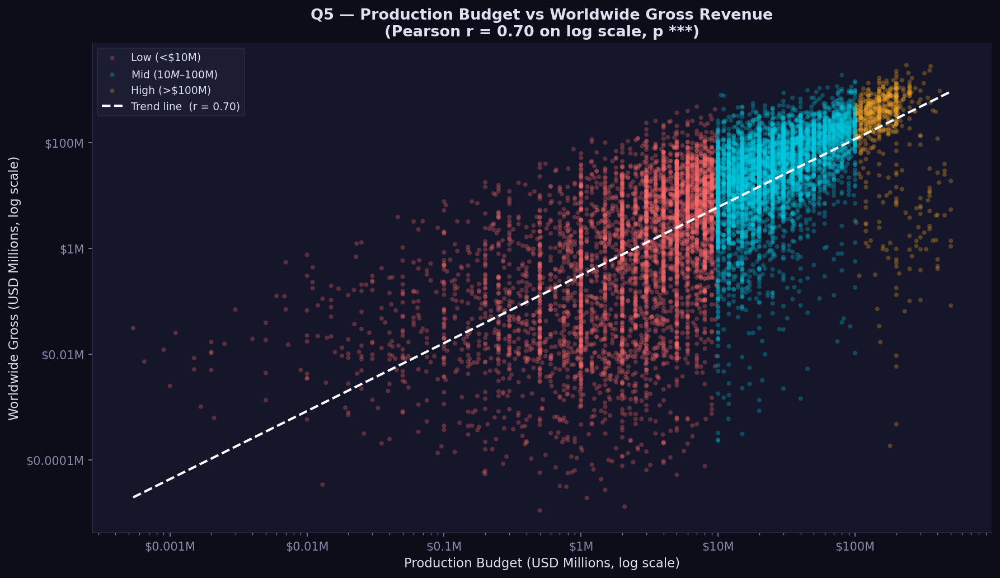

**Interpretation:** Budget and worldwide gross are strongly related, but the relationship is not perfect. High-budget movies generally earn more and have the strongest median profitability, but they also require large returns to justify the investment. Low-budget movies can produce spectacular breakout ROI, but the median ROI is negative, meaning many low-budget movies do not become financially successful. The graphs show that genre changes the meaning of budget: high spending is most effective when paired with genres that benefit from spectacle and international appeal.

**Student responsible:** Ghofran Mahmoud
:::

::: {.report-page}
## Descriptive Question 6 (Ghofran Mahmoud)

**Question:** Do movies with well-known directors, writers, or stars receive higher ratings or more votes?

This question tests the idea of star power. In the film industry, well-known actors, directors, and writers are often expected to improve audience interest or trust. The dataset does not contain direct fame scores, so the notebook uses appearance frequency as a proxy for prominence.

**How we worked with the data:** Stars, directors, and writers were parsed from list-like text into usable lists. The notebook created high-profile and low-profile groups based on how often people appeared in the dataset. Ratings and votes were then compared across those groups, and Mann-Whitney U tests were used for rating comparisons.

**Objective:** Evaluate whether talent prominence is meaningfully connected to ratings or votes. This objective tests whether the presence of frequently appearing stars, directors, or writers is associated with stronger audience response. It is relevant because film marketing often emphasizes recognizable names, but recognition does not automatically mean higher audience satisfaction. The analysis uses the available dataset to see whether this idea is supported by ratings and votes. It also discusses the limitation that appearance frequency is only a proxy for fame, not a perfect measure of real-world celebrity power.

**Results and graphs:** Median rating was 6.30 for high-profile and low-profile groups across stars, directors, and writers. The statistical test was not meaningful in practical size: directors and writers had statistically significant p-values, but the medians were still identical.

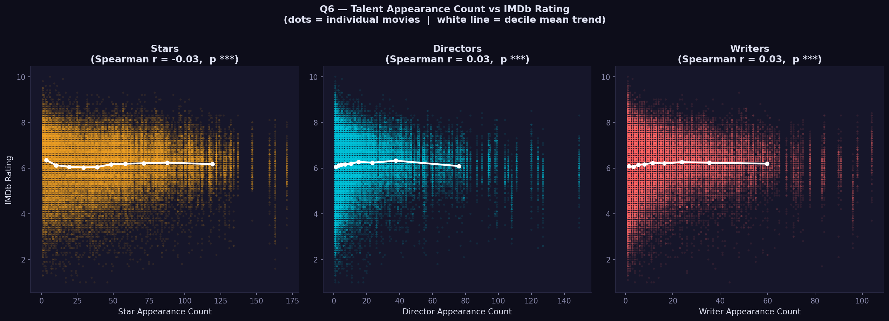

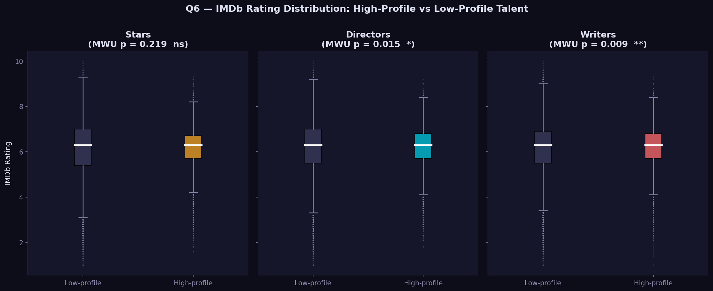

**Interpretation:** The results do not support a strong practical talent effect on ratings. Even when statistical significance appears, the actual difference is too small to matter in real audience evaluation. Vote patterns are harder to interpret because appearance frequency is not a perfect measure of fame. A person may appear often in smaller films without being globally famous. For movie success, the analysis suggests that story, genre, budget, release visibility, and audience fit matter more than a simple count-based talent profile.

**Student responsible:** Ghofran Mahmoud
:::

::: {.part-divider}
# Part 2: Machine Learning
:::

::: {.report-page}
## Machine Learning Question 1 (Aya Abdine & Meriam El Askri)

**Question:** Can movie success, measured by rating, be predicted using features such as genre, duration, budget, and release date?

This question moves from describing rating patterns to predicting rating. The target is continuous IMDb rating, so the problem is a regression task. The main challenge is that ratings are subjective. They depend on audience taste, expectations, story quality, and many factors that are not fully captured in structured metadata.

**How we worked with the data:** Numeric variables were cleaned, genre and MPA indicators were selected, and a compact feature matrix was created. Ridge Regression, Extra Trees, and Gradient Boosting were compared. Ridge Regression is a linear baseline, while Extra Trees and Gradient Boosting can capture nonlinear relationships.

**Objective:** Estimate movie rating from cleaned movie attributes and identify the best-performing model. This objective asks whether structured information available in the dataset can approximate audience evaluation before looking directly at the final rating. It is useful because rating is subjective and may depend on story quality, acting, cultural expectations, and viewer taste. The model comparison shows whether nonlinear machine learning methods can capture more of that complexity than a simple linear baseline. The goal is not to predict ratings perfectly, but to measure how much signal exists in the cleaned movie features.

**Results and graphs:**

| Model | MAE | RMSE | R2 Score |
|---|---:|---:|---:|
| Gradient Boosting | 0.6406 | 0.8531 | 0.3649 |
| Extra Trees | 0.6496 | 0.8590 | 0.3561 |
| Ridge Regression | 0.6903 | 0.9159 | 0.2679 |

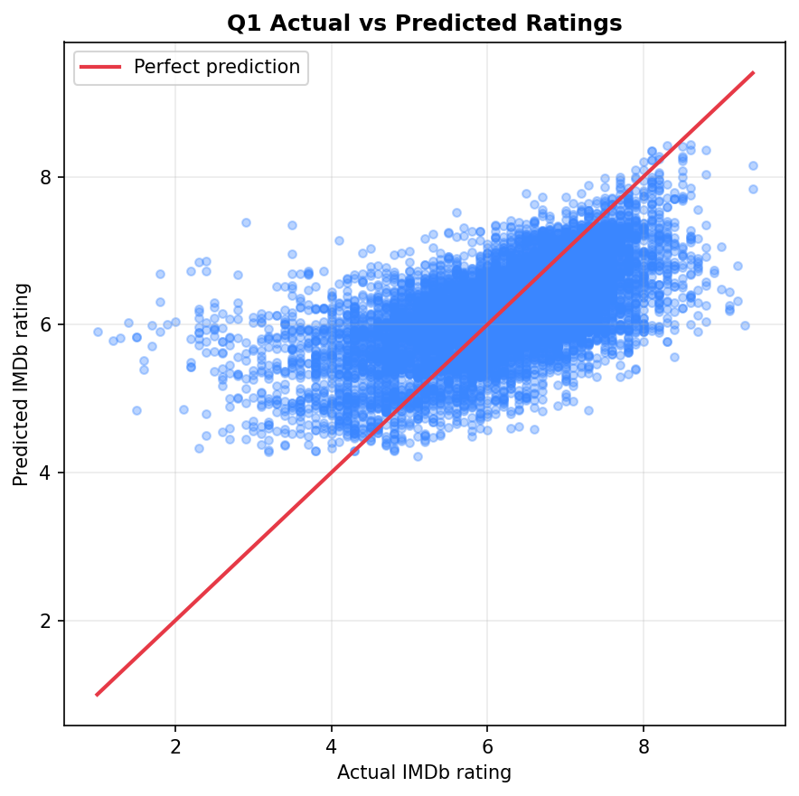

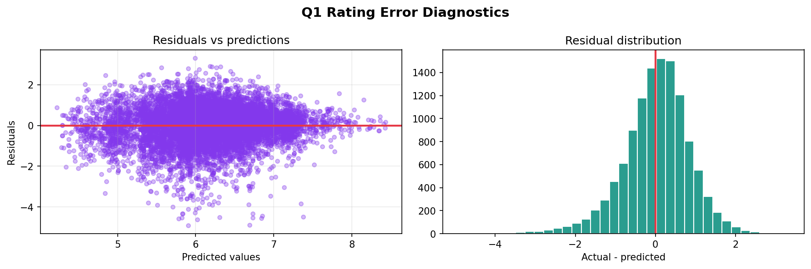

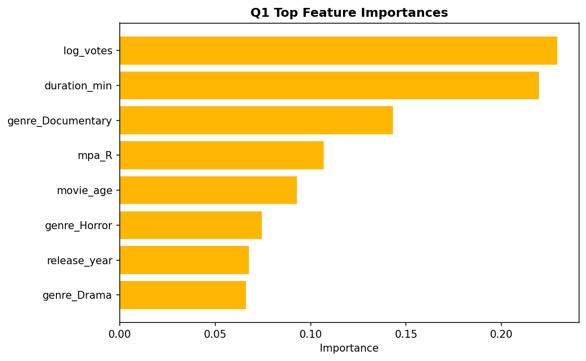

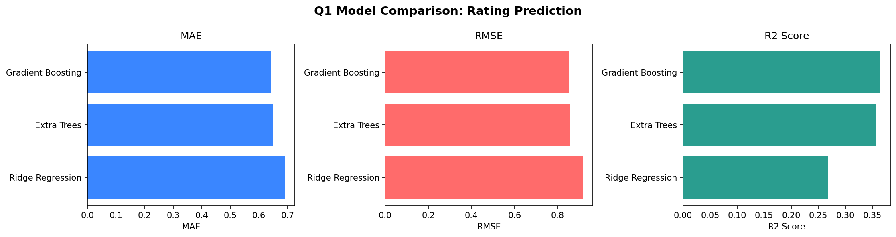

**Interpretation:** Gradient Boosting was the best model, with MAE around 0.64 rating points and R2 around 0.365. This means the model can make useful rating estimates, but it explains only part of the variation. That is expected because ratings depend heavily on subjective audience response and content quality. The residual and prediction plots show that the model performs reasonably near the average rating range but struggles more with extreme ratings.

**Student responsible:** Aya Abdine & Meriam El Askri
:::

::: {.report-page}
## Machine Learning Question 2 (Aya Abdine & Meriam El Askri)

**Question:** Can box office revenue be predicted using movie characteristics such as genre, stars, directors, and budget?

Revenue prediction is a different problem from rating prediction because revenue is extremely skewed. Most movies earn modest amounts, while a small number of blockbusters earn very large totals. This makes raw revenue difficult to model directly.

**How we worked with the data:** Worldwide gross was log-transformed to reduce the influence of extreme blockbuster values. Cleaned numeric and categorical attributes were used as predictors. Ridge Regression, Extra Trees, and Gradient Boosting were compared.

**Objective:** Predict worldwide gross revenue and determine whether cleaned movie attributes can explain commercial scale. This objective focuses on financial prediction, where the target is much more uneven than ratings. A few blockbuster movies earn extremely large totals, while many films earn modest revenue. The analysis therefore tests whether machine learning can learn the broad revenue level of a movie from features such as budget, genre, and movie personnel. It also shows why log transformation is necessary when the outcome contains extreme values.

**Results and graphs:**

| Model | MAE (Log) | RMSE (Log) | R2 Score | MAE Original Scale |
|---|---:|---:|---:|---:|
| Gradient Boosting | 1.4918 | 2.0031 | 0.6453 | $20,960,526 |
| Extra Trees | 1.5491 | 2.0449 | 0.6303 | $26,763,340 |
| Ridge Regression | 1.7463 | 2.2780 | 0.5412 | $23,760,840 |

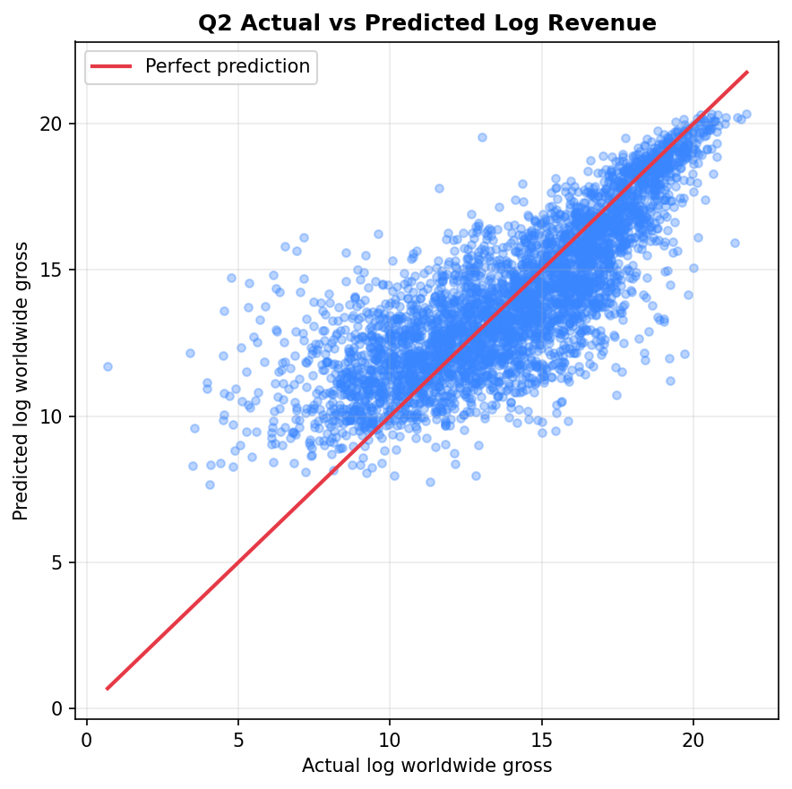

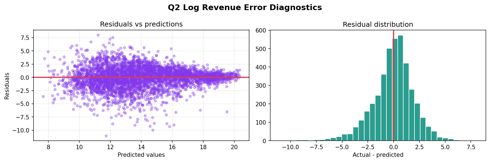

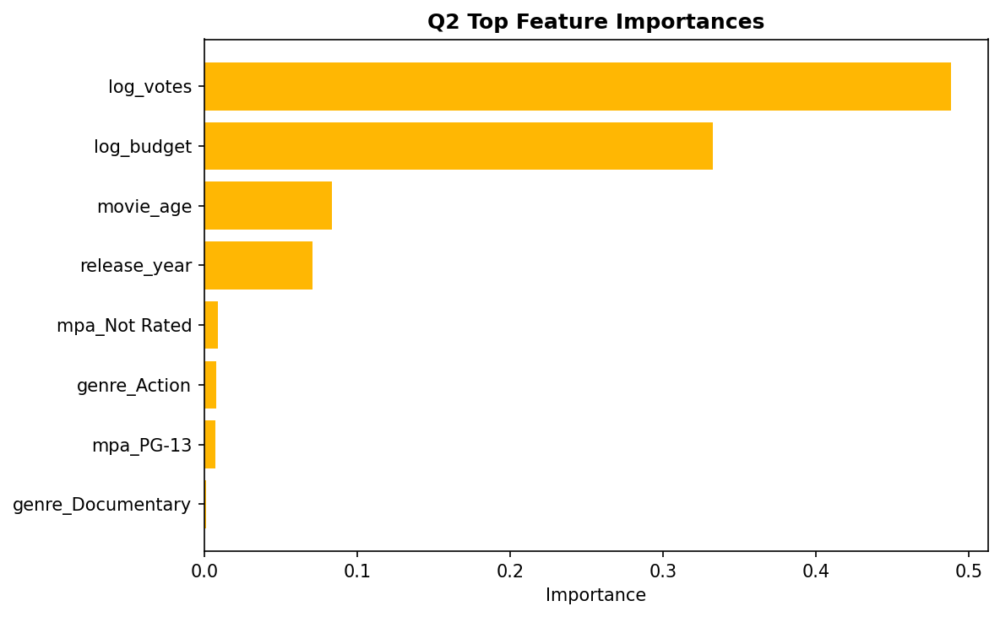

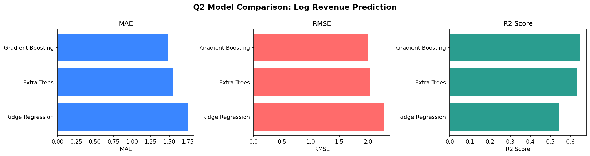

**Interpretation:** Revenue was more predictable than rating. Gradient Boosting explained about 64.5% of the variation in log worldwide revenue, which is a strong result for this type of dataset. Budget, genre, and other structured movie features carry meaningful box office information. However, the original-scale MAE is still large because blockbuster revenue is difficult to predict precisely. The model can estimate broad revenue level better than exact final revenue.

**Student responsible:** Aya Abdine & Meriam El Askri
:::

::: {.report-page}
## Machine Learning Question 3 (Aya Abdine & Meriam El Askri)

**Question:** Can we predict whether a movie will receive a high rating based on its features?

This question turns rating prediction into classification. Instead of predicting the exact rating number, the model predicts whether a movie belongs to the high-rated group. This is often more practical because decision makers may only need to know whether a movie is likely to perform above a quality threshold.

**How we worked with the data:** The rating target was converted into a binary label. The training data was balanced, and four classifiers were compared: Logistic Regression, Random Forest, Gradient Boosting, and Extra Trees. Decision thresholds were tuned so the model did not rely blindly on the default 0.50 cutoff.

**Objective:** Classify movies as high-rated or not high-rated and evaluate which model best balances precision and recall. This objective turns the rating problem into a clearer decision task. Instead of asking for the exact rating, the model asks whether a movie belongs to a stronger quality group. That is useful because many real decisions are threshold-based: a movie may be treated as promising if it is likely to be high-rated. The analysis also explains why accuracy alone is not enough and why precision, recall, F1 score, and ROC AUC are needed.

**Results and graphs:**

| Model | ROC AUC | Threshold | Accuracy | Balanced Accuracy | Precision | Recall | F1 Score |
|---|---:|---:|---:|---:|---:|---:|---:|
| Random Forest | 0.8732 | 0.57 | 0.8627 | 0.7476 | 0.7473 | 0.5458 | 0.6308 |
| Gradient Boosting | 0.8691 | 0.58 | 0.8596 | 0.7431 | 0.7377 | 0.5388 | 0.6227 |
| Extra Trees | 0.8586 | 0.48 | 0.8556 | 0.7349 | 0.7284 | 0.5233 | 0.6090 |
| Logistic Regression | 0.8062 | 0.52 | 0.8392 | 0.7250 | 0.6581 | 0.5248 | 0.5839 |

Best model: Random Forest. Confusion matrix: `[[6930, 369], [908, 1091]]`.

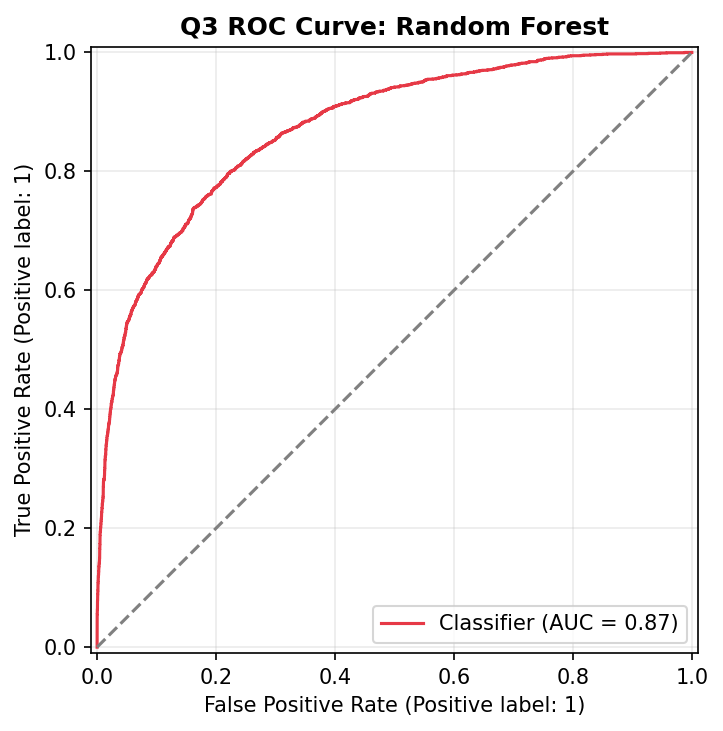

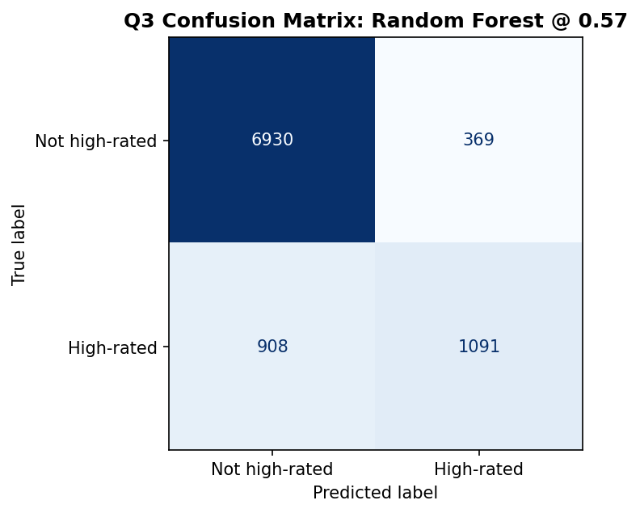

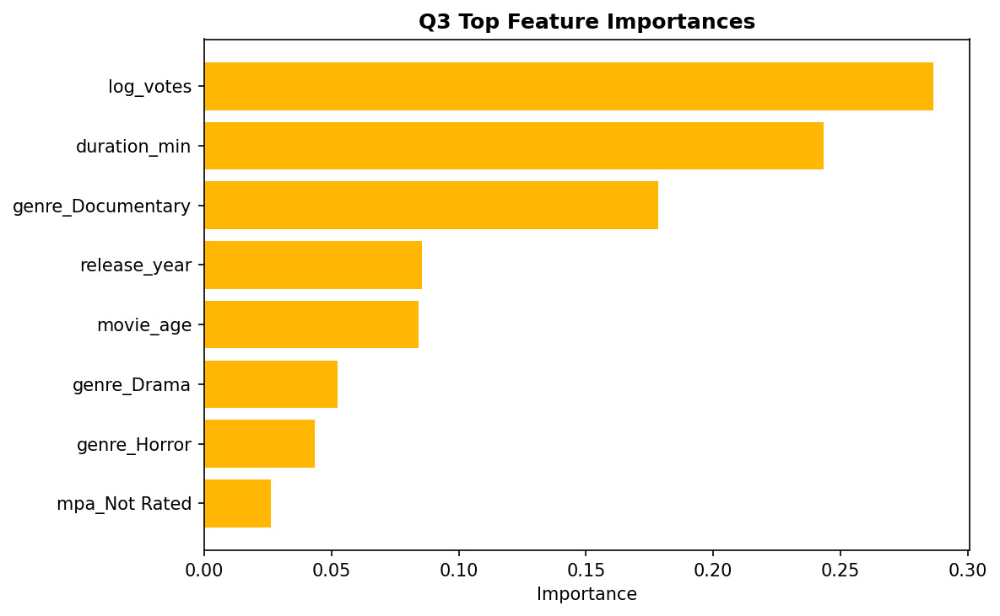

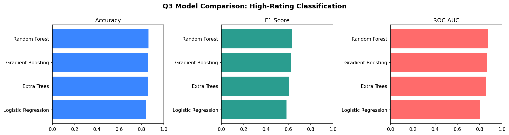

**Interpretation:** Random Forest was the strongest classifier. It achieved high overall accuracy and the best ROC AUC, meaning it ranked high-rated movies better than the other models. The confusion matrix shows that the model is especially strong at identifying not-high-rated movies. It also identifies many high-rated movies, but recall is lower for the high-rated class, meaning some genuinely high-rated films are missed. This is a realistic limitation because high ratings depend on content and audience response, not only metadata.

**Student responsible:** Aya Abdine & Meriam El Askri
:::

::: {.report-page}
## Machine Learning Question 4 (Mcolisi Austine)

**Question:** Can the number of audience votes be predicted using movie popularity factors such as stars, release date, and budget?

Votes represent audience engagement. A movie with many votes usually reached more viewers, created more discussion, or became more visible. Vote prediction is challenging because vote counts are highly skewed: a few movies receive enormous attention, while most movies receive much less.

**How we worked with the data:** The notebook compared three strategies: raw vote prediction, log-transformed vote prediction, and log prediction after removing outliers. Linear Regression, Decision Tree, and Random Forest models were evaluated. This allowed the analysis to show how much transformation improves the model.

**Objective:** Predict audience vote count and understand whether popularity can be modeled from available movie features. This objective studies engagement rather than quality or revenue. Vote count reflects how much attention a movie receives from IMDb users, which can be influenced by release year, visibility, rating, budget, stars, and cultural attention. Because vote counts are extremely skewed, the objective also includes testing whether transformations make the prediction problem more realistic. The goal is to understand whether popularity has predictable structure or is mostly driven by external hype.

**Results and graphs:** The raw-scale Decision Tree had MAE = 24,665.91 and R2 = 0.204. After log transformation, Decision Tree improved to MAE = 1.4248 and R2 = 0.4317. After outlier removal, Decision Tree had MAE = 1.2933 and R2 = 0.3878.

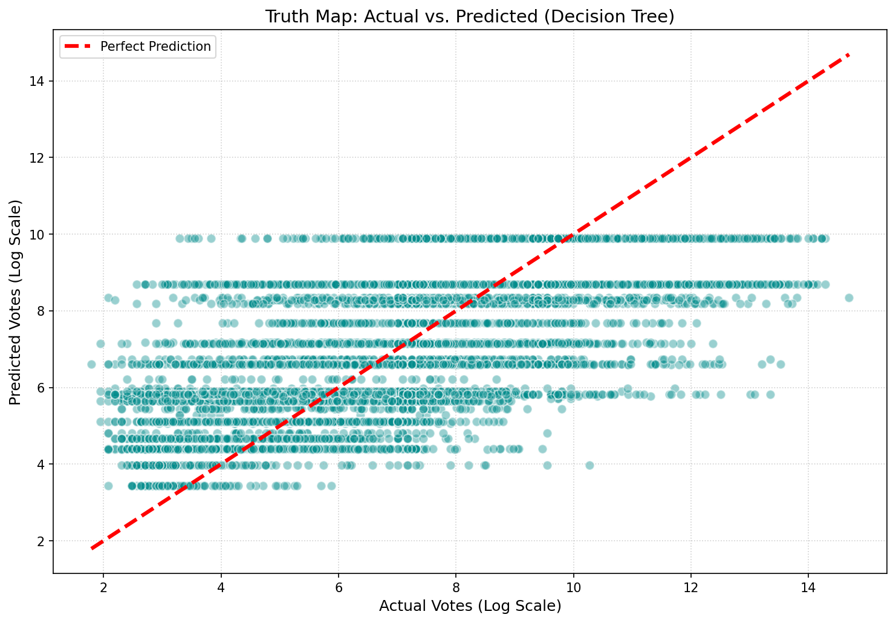

**Interpretation:** The log transformation clearly improved the modeling problem. Instead of forcing the model to predict exact vote counts dominated by blockbuster extremes, the log scale allowed it to predict the magnitude of popularity. The notebook found average rating and release year to be especially important, followed by month and star count. The conclusion is that audience votes can be predicted to a useful degree, but viral attention, marketing, franchise hype, and word of mouth remain outside the dataset.

**Student responsible:** Mcolisi Austine
:::

::: {.report-page}
## Machine Learning Question 5 (Syed Arshan Nehad)

**Question:** How does the timing of a movie's release influence box office performance and audience engagement?

Release timing can matter because movies are not released into a neutral market. Summer, holiday periods, awards seasons, and quieter months may attract different audiences and different types of movies. This question asks whether timing still matters after considering budget, runtime, genre, and crew information.

**How we worked with the data:** Release date was parsed into year, month, and season. Season was kept as the main timing variable because it is easier to interpret than individual month. Budget, runtime, crew counts, and primary genre were used as controls. Worldwide gross and votes were log-transformed.

**Objective:** Test whether release season helps predict worldwide gross and audience votes. This objective investigates whether timing contributes to performance after other movie characteristics are considered. Release season may matter because audience behavior changes around holidays, summer periods, awards seasons, and school schedules. However, timing can be mixed with budget and genre because studios often release major films in specific windows. The model therefore uses season together with controls so the interpretation is more careful.

**Results and graph:**

| Target | Best Model | MAE (Log) | RMSE (Log) | R2 Score |
|---|---|---:|---:|---:|
| Audience Votes | Random Forest | 1.1720 | 1.4987 | 0.6064 |
| Worldwide Gross | Decision Tree | 1.8762 | 2.4167 | 0.4837 |

Top predictors for audience votes were `budget_num`, `year`, `writer_count`, `star_count`, `runtime`, and `season_Autumn`. Top predictors for worldwide gross were mainly `budget_num`, `year`, genre indicators, and runtime.

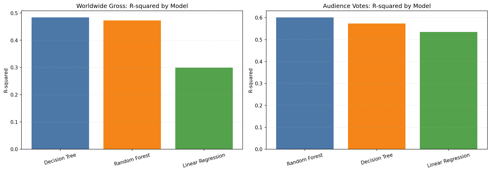

**Interpretation:** Release timing has some predictive value, but it is not the dominant factor. Budget and year are more important, which suggests that financial scale and historical context explain more variation than season alone. Season still appears in the audience-vote feature importance list, so timing may influence engagement, especially when movies are released in periods with stronger audience attention. The safest interpretation is that timing matters as part of a larger release strategy, not as an independent guarantee of success.

**Student responsible:** Syed Arshan Nehad
:::

::: {.report-page}
## Machine Learning Question 6 (Syed Tamjeed Ur Rahman)

**Question:** Can movies be classified into successful versus less successful categories based on their attributes?

The final machine learning question combines the project idea of success into one binary classification problem. Instead of using only rating or only revenue, success is defined across multiple dimensions: rating quality, audience reach, and financial return.

**How we worked with the data:** A movie was labeled successful if it met at least two of three conditions: rating above the median, votes above the median, and positive ROI. Leakage variables used to build the label were excluded from the predictors. The model therefore had to learn from attributes such as budget, year, runtime, genre, season, MPA rating, and cast or crew counts.

**Objective:** Build a classifier that predicts whether a movie is successful or less successful using non-leakage movie attributes. This objective combines the project’s main idea that movie success has more than one dimension. A movie is treated as successful only when it performs well across at least two of rating, audience attention, and profitability. The model excludes variables used to build the label so it cannot cheat by reading the answer directly. This makes the classification task harder but more honest, and it shows whether pre-release-style attributes can still separate successful films from less successful ones.

**Results and graph:**

| Model | Accuracy | Precision | Recall | F1 Score | ROC-AUC |
|---|---:|---:|---:|---:|---:|
| Random Forest | 0.7004 | 0.7069 | 0.6989 | 0.7029 | 0.7665 |
| Logistic Regression | 0.5103 | 0.5087 | 0.9991 | 0.6741 | 0.3318 |
| Decision Tree | 0.6639 | 0.6926 | 0.6061 | 0.6465 | 0.7231 |

Top Q6 predictors were `budget_num`, `year`, `writer_count`, `runtime`, `primary_genre_Drama`, `primary_genre_Comedy`, `primary_genre_Action`, and season indicators.

**Interpretation:** Random Forest was the best classifier, with the strongest F1 score and ROC-AUC. Accuracy around 0.70 means the model learned useful patterns, but it is not perfect. That is expected because movie success depends on many external forces that are not in the dataset, including marketing, distribution scale, reviews, social media attention, and competition at release. The model is still valuable because it shows that pre-release and structural attributes can separate successful from less successful movies better than random guessing.

**Student responsible:** Syed Tamjeed Ur Rahman
:::

::: {.report-page}
# Conclusion

This project shows that movie success is multidimensional. The descriptive analysis found that countries and genres differ in average ratings, but those rating patterns do not automatically match revenue or audience engagement. Genre is one of the strongest commercial signals, especially for action, superhero, animation, and franchise-oriented movies. Runtime does not show a simple relationship with ratings or votes. Budget is strongly related to worldwide gross, but profitability depends on the size of the investment and the genre context. Talent prominence, measured through appearance count, does not meaningfully change ratings.

The machine learning analysis shows that prediction improves when the data is carefully cleaned and transformed. Rating prediction was possible but limited, which makes sense because ratings depend on subjective audience response. Revenue prediction was stronger because budget, genre, and release-related features contain clearer commercial information. Classification models performed well for high-rating prediction and overall success classification, with Random Forest usually giving the best classification results. Vote prediction improved after log transformation, confirming that skewed popularity data needs careful treatment.

The main limitation is that the dataset does not include all factors that influence movie performance. Marketing spend, release size, critic reviews, social media activity, franchise history, streaming availability, and competition from other releases are missing. Future work could add these variables, separate domestic and international models, and test whether the models generalize to newer movies. Even with these limitations, the project gives a clear evidence-based view of how movie characteristics relate to ratings, engagement, revenue, and predicted success.
:::
