# Machine Learning Analysis

This report summarizes the machine-learning work station in a readable Quarto format. The full notebook remains available as `WORK STATION FOR MACHINE LEARNING.ipynb`.

## Research Questions

1. Can movie rating be predicted from movie features?
2. Can box office revenue be predicted from movie characteristics?
3. Can we predict whether a movie will receive a high rating?
4. Can the number of audience votes be predicted?
5. How does release timing influence box office performance and engagement?
6. Can movies be classified as successful versus less successful?

## Q1: Rating Prediction

The target was continuous IMDb rating. Predictors included genre, duration, budget, log votes, release date, MPA rating, stars, and directors. Ridge Regression, Extra Trees, and Gradient Boosting were compared.

**Finding:** Gradient Boosting performed best with R2 = 0.365, MAE = 0.641, and RMSE = 0.853. Log votes were the dominant predictor, but metadata explains only part of rating variation.

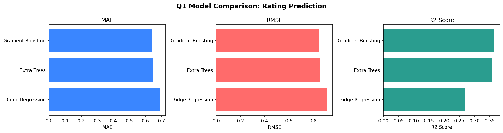

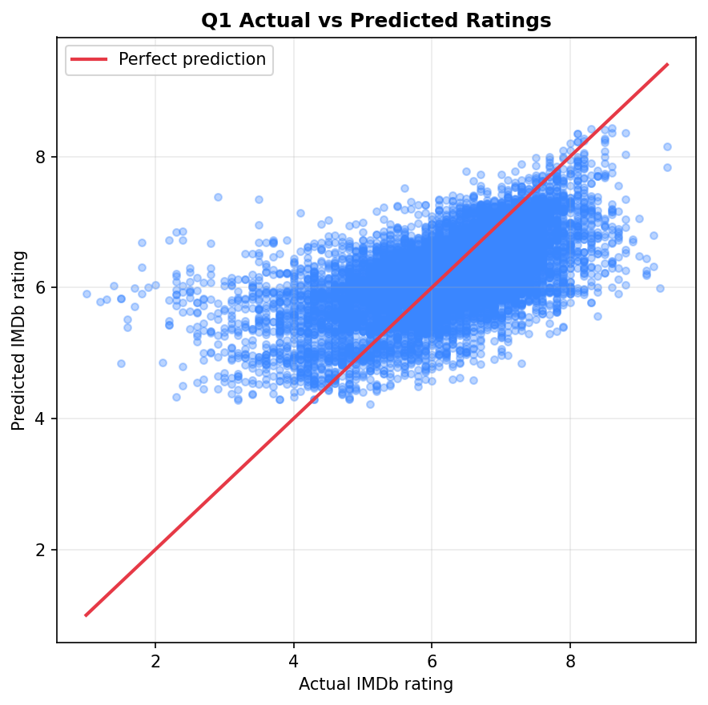

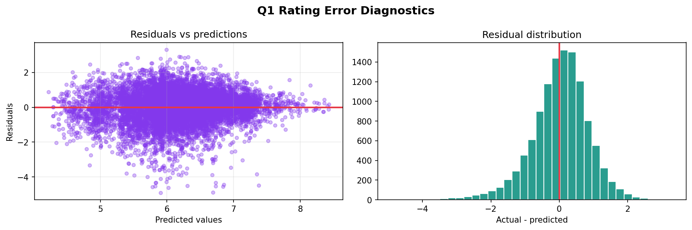

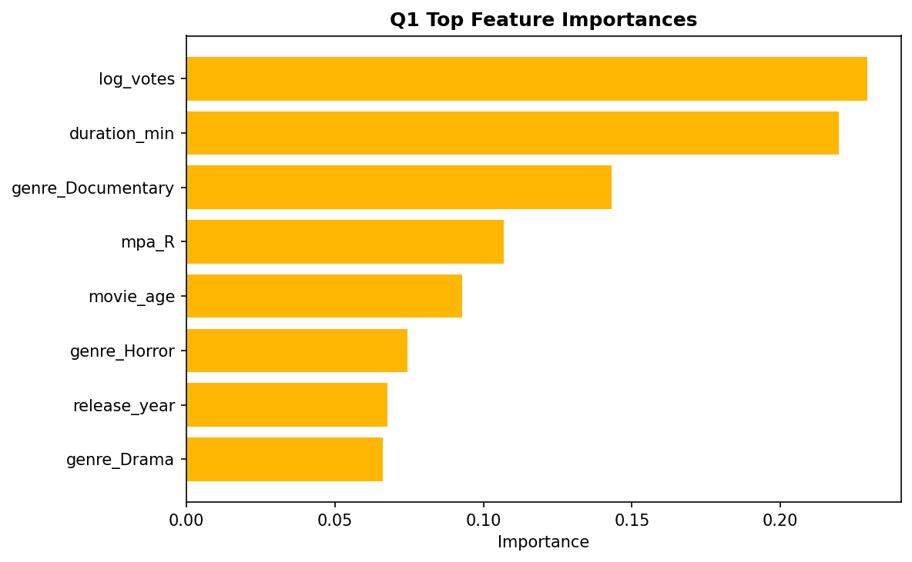

## Q2: Revenue Prediction

The target was worldwide gross revenue. Because revenue is highly skewed, the target was log-transformed before model training.

**Finding:** Revenue is more predictable than rating. Gradient Boosting performed best with R2 = 0.645 and raw-scale MAE of about $21M. The log transformation reduced blockbuster dominance.

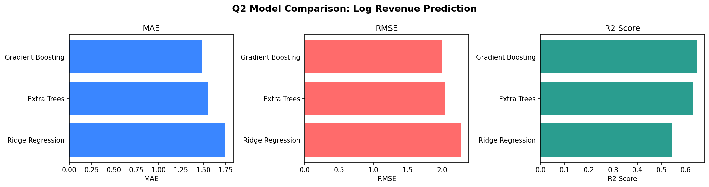

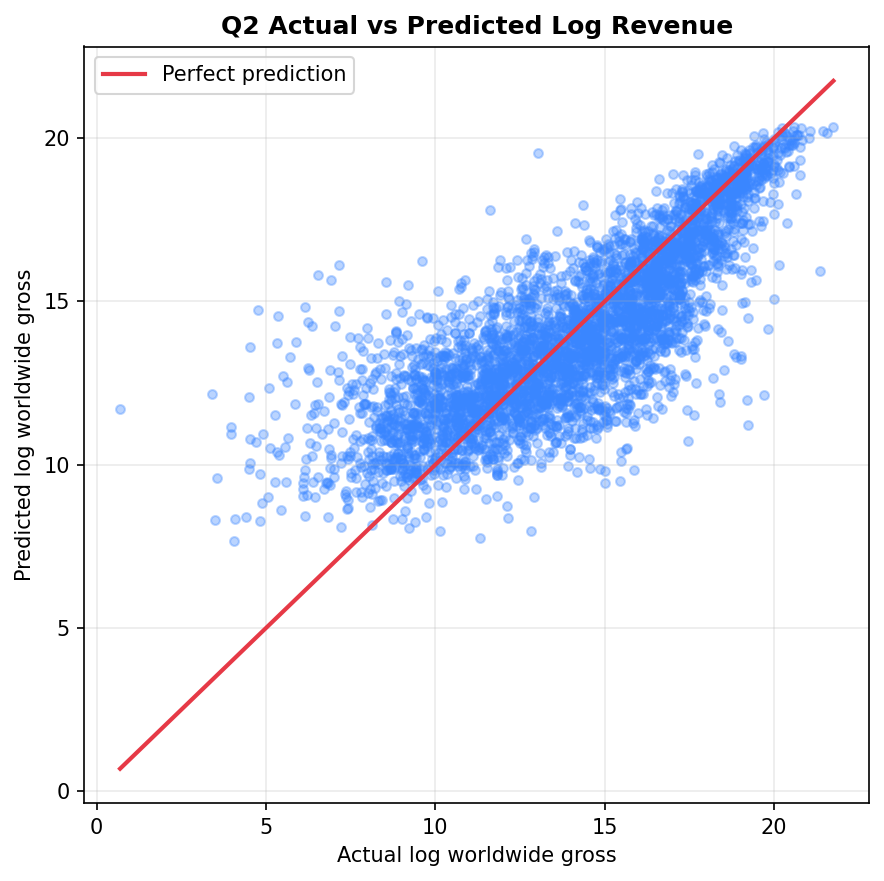

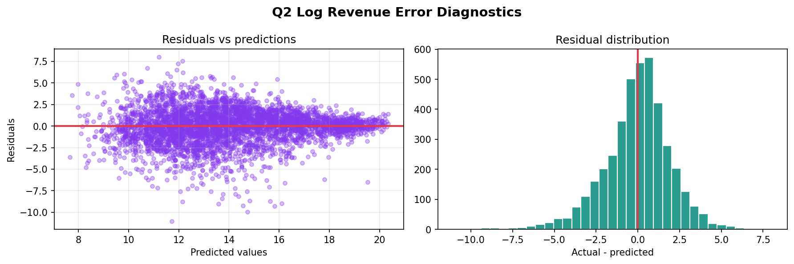

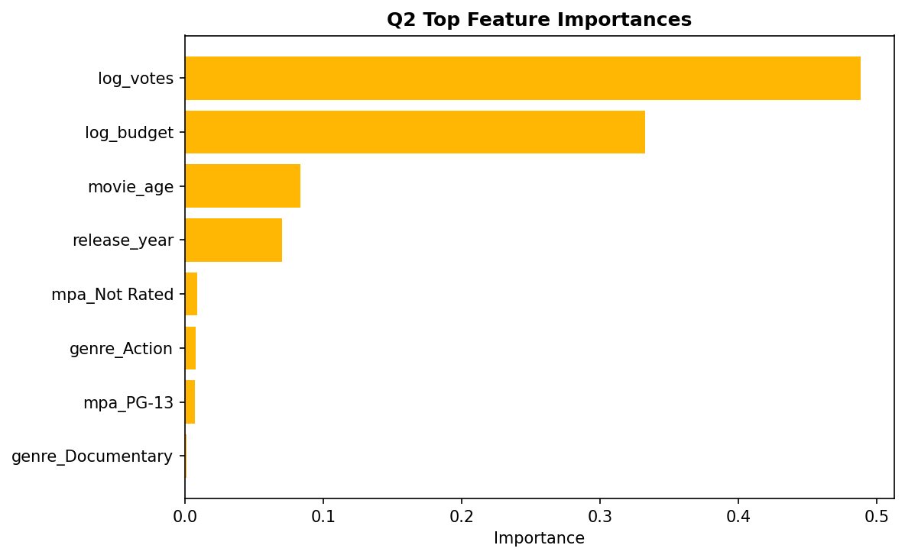

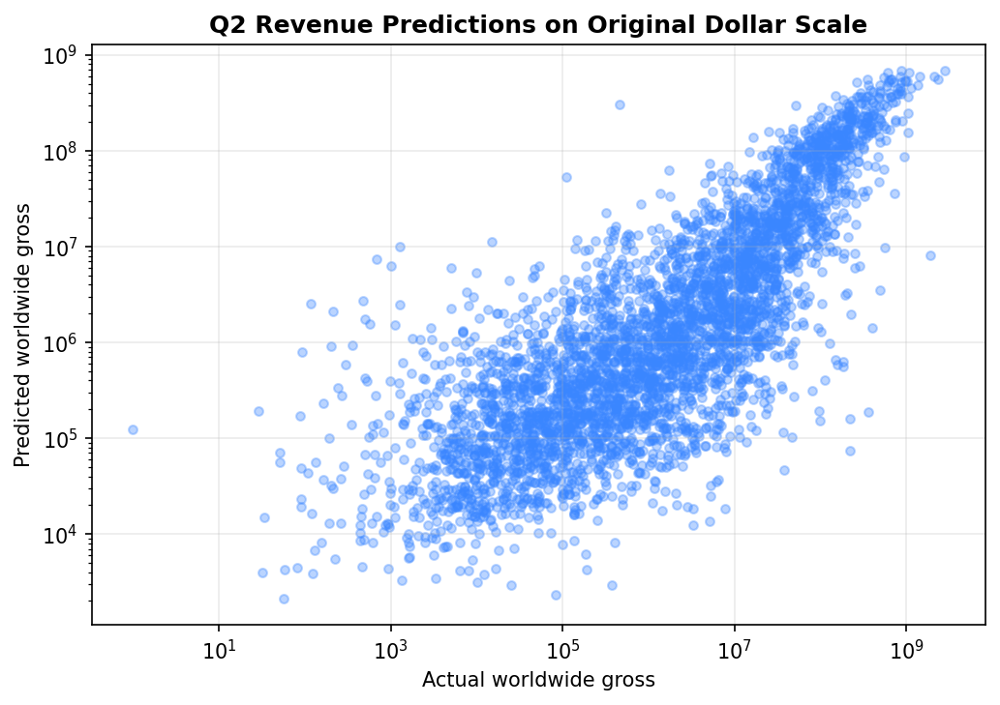

## Q3: High-Rating Classification

The task was binary classification: high-rated versus not high-rated. Ambiguous middle ratings were removed, training data was balanced, and model thresholds were tuned.

**Finding:** Random Forest achieved the strongest result with ROC AUC = 0.873 and accuracy = 86.3%. Balanced training and threshold tuning were important improvements over default classification.

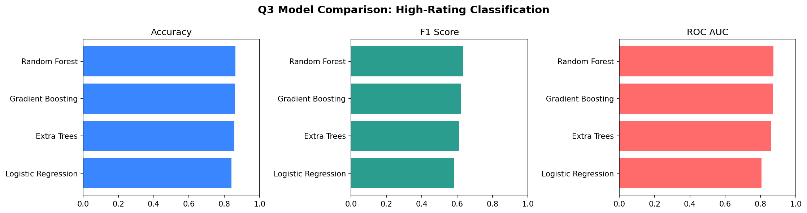

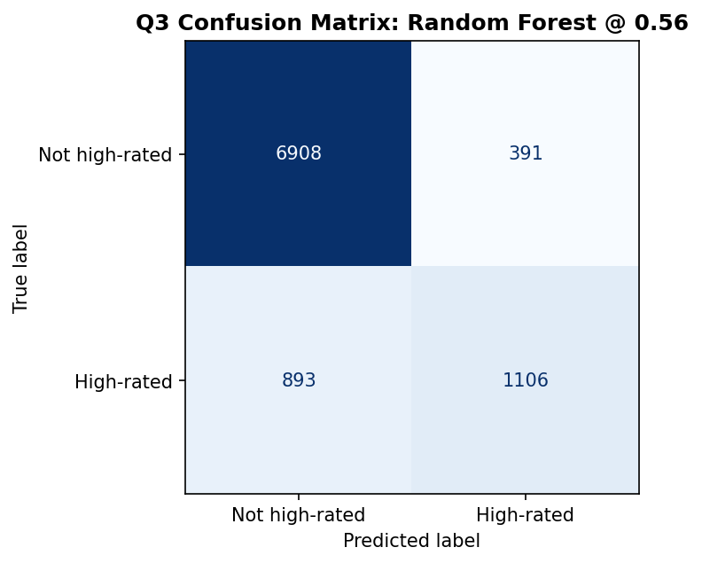

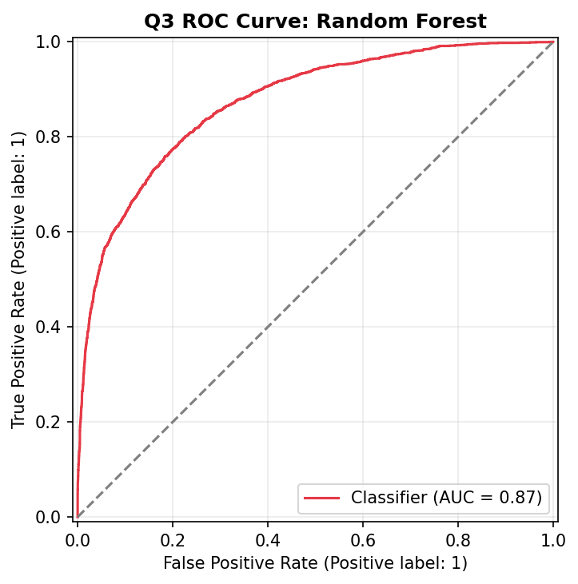

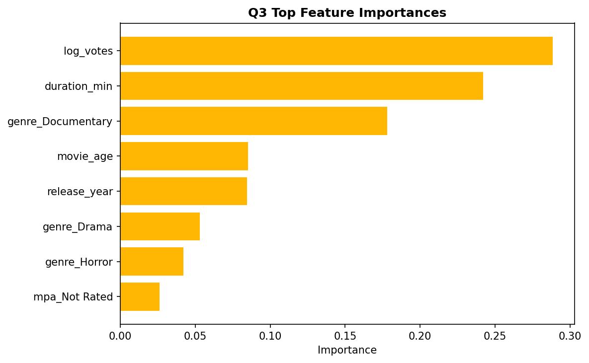

## Q4: Audience Vote Prediction

Audience votes were modeled using popularity-related features such as release date, rating, runtime, and star count. Several transformations were tested to reduce skew.

**Finding:** Log transformation dramatically improved performance. After transformation, a Decision Tree achieved R2 = 0.432. Rating and release year were the most important predictors, but viral attention and marketing are not captured by the dataset.

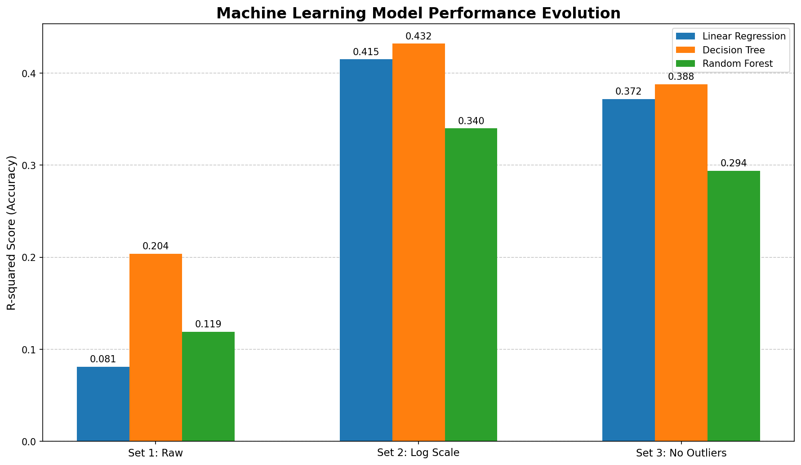

## Q5: Release Timing and Performance

Release date was parsed into year, month, and season. Season was tested alongside budget, runtime, crew counts, and primary genre. Worldwide gross and votes were log-transformed.

**Finding:** Random Forest achieved R2 = 0.606 for audience votes, while Decision Tree reached R2 = 0.484 for worldwide gross. Budget and release year were more important than season alone, although season still appeared in feature importance.

## Q6: Success Classification

The binary success target combined three dimensions: above-median rating, above-median votes, and positive ROI. A movie was labeled successful if it met at least two of the three conditions.

**Finding:** Random Forest was the best classifier with 70.0% accuracy and ROC AUC = 0.767. The model captures useful patterns, but success cannot be fully predicted without marketing, distribution, and streaming data.

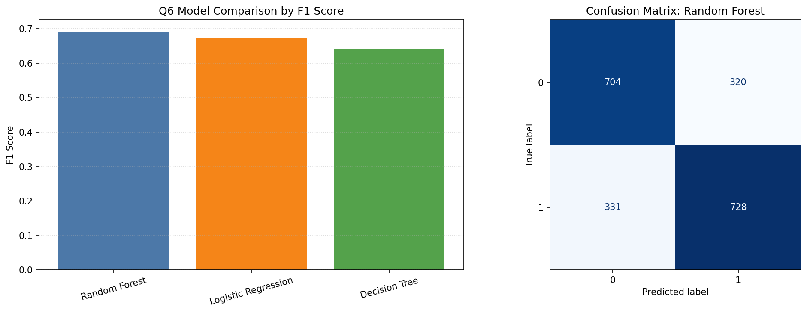

## Conclusion

The machine-learning results show that financial and engagement outcomes are more predictable than subjective ratings. Ensemble and tree-based models consistently outperform simpler baselines, especially when skewed targets are transformed.
