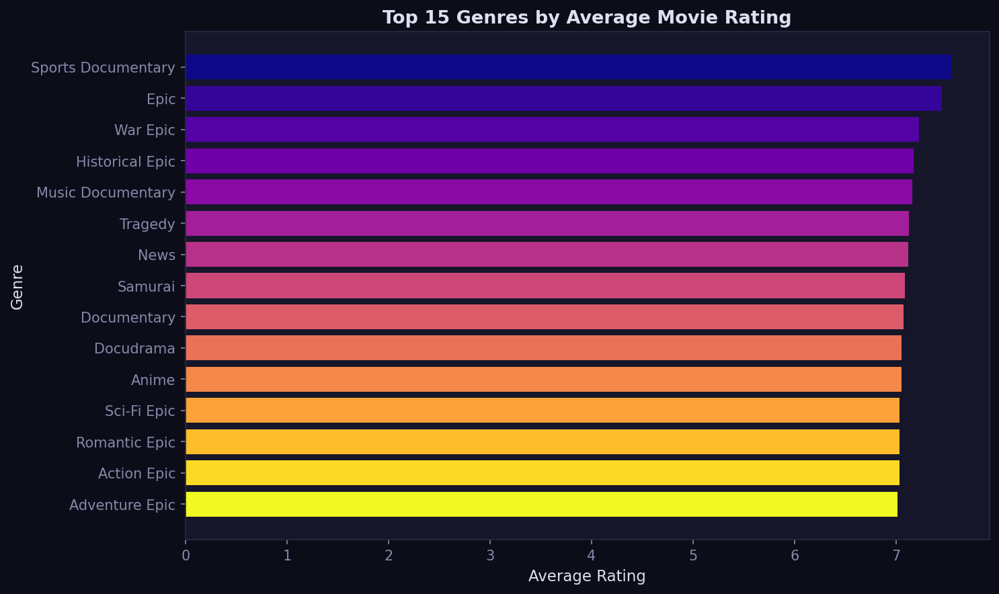
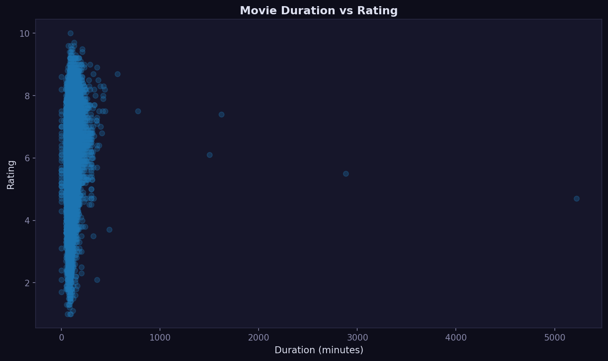
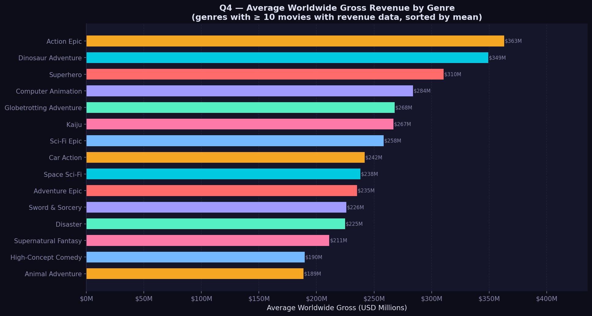
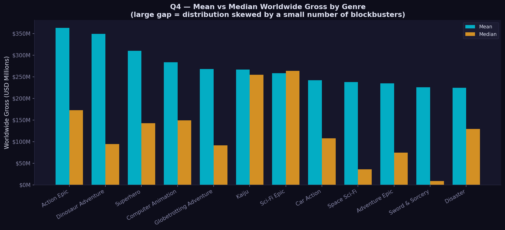
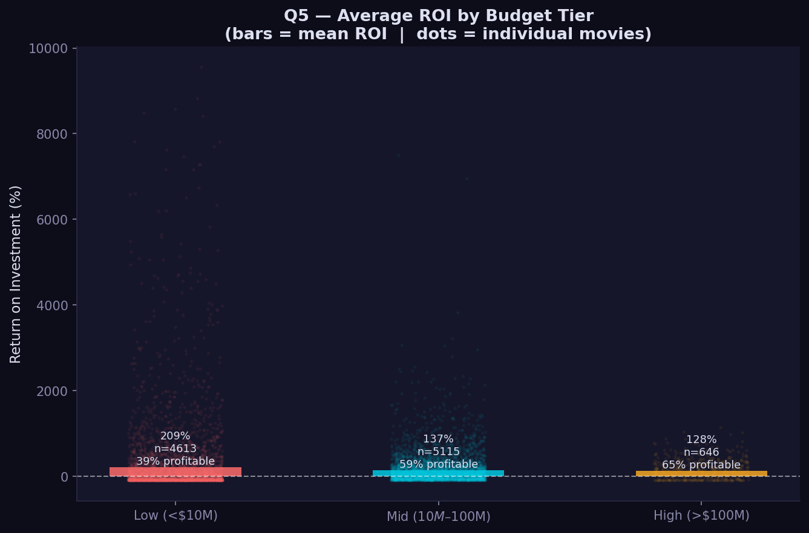
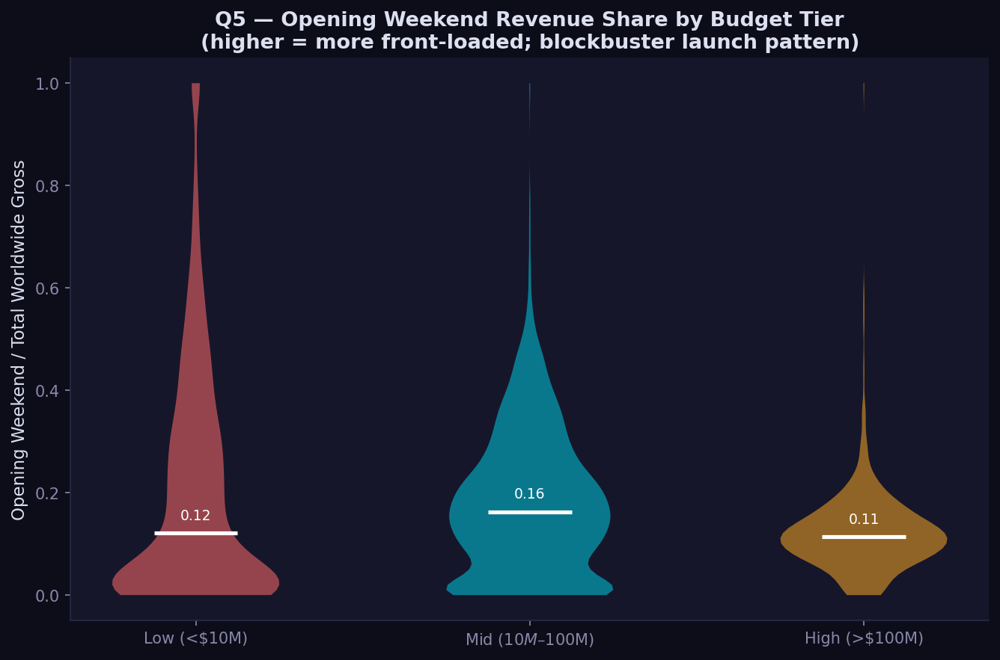
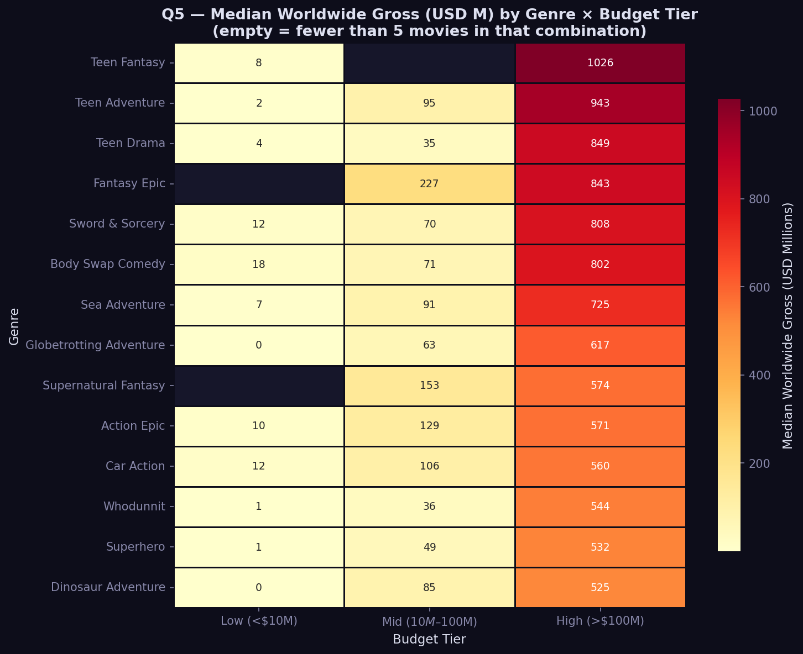
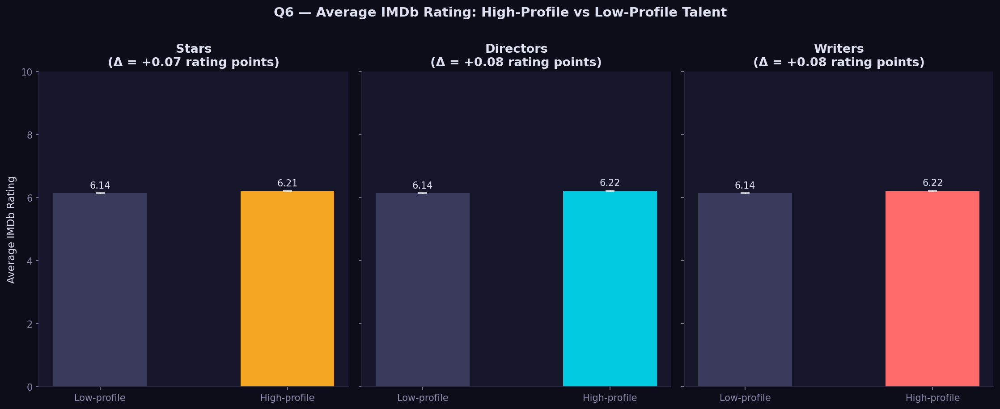
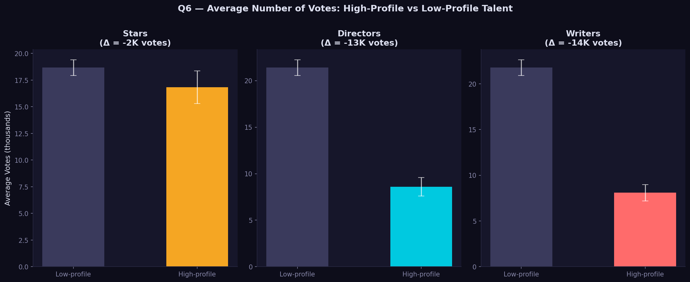

# Descriptive Analysis

This report summarizes the descriptive analysis work station in a readable Quarto format. The full notebook remains available as `WORK STATION FOR DESCRIPTIVE ANALYSIS.ipynb`.

## Research Questions

1. How do movie ratings vary across countries and industries?
2. Which genres receive the highest ratings and most votes?
3. How does movie duration influence ratings and votes?
4. How do box office revenues differ across industries?
5. Is there a relationship between budget and box office performance?
6. Do movies with well-known directors, writers, or stars receive higher ratings or more votes?

## Q1: Ratings by Country and Industry

The country column was cleaned, split, and grouped. Ratings were converted to numeric values and countries with too few observations were filtered out.

**Finding:** Average ratings differ noticeably by country. Smaller or more selective industries can rank higher because only stronger or more internationally visible films tend to appear in the dataset. Larger industries show more variation.

## Q2: Genre Ratings and Votes

Genre values were parsed from list-like text and grouped. Average rating and average vote count were calculated separately to distinguish appreciation from audience size.

**Finding:** Ratings and votes are not the same signal. Documentary, historical, and epic genres earn strong ratings, while action and franchise genres drive larger vote counts.

## Q3: Duration, Ratings, and Votes

Runtime was converted to minutes, then compared with ratings and vote counts.

**Finding:** Most movies fall between 80 and 150 minutes. Within that range, ratings vary widely, so runtime alone does not predict whether a movie is highly rated. Audience engagement is more strongly shaped by popularity, genre, and release scale.

## Q4: Revenue Differences Across Industries

Revenue values were converted from currency text to numeric values. The primary genre was used for grouping, and international revenue was calculated as worldwide gross minus US and Canada gross.

**Finding:** Revenue is strongly genre-dependent. Action, superhero, animation, and franchise categories dominate because they tend to have large budgets, wide releases, and strong international appeal. The Kruskal-Wallis test confirms statistically significant differences across groups.

## Q5: Budget and Box Office Performance

Budget and worldwide gross were analyzed on log scales, and profitability was compared by budget tier.

**Finding:** Budget and worldwide gross have a strong positive relationship. High-budget films have the highest profitability rate, but they also require large returns. Low-budget films can produce extreme ROI, although their median ROI is negative.

## Q6: Talent Profile, Ratings, and Votes

Talent profile was approximated through appearance counts for stars, directors, and writers.

**Finding:** Median rating is 6.30 for both high-profile and low-profile groups across stars, directors, and writers. Star power appears to boost visibility through votes more than quality evaluation through ratings.

## Conclusion

The descriptive analysis shows that movie success depends on the outcome being measured. Ratings reflect audience evaluation, votes reflect visibility and engagement, and revenue reflects genre economics, budget, distribution scale, and international appeal.
